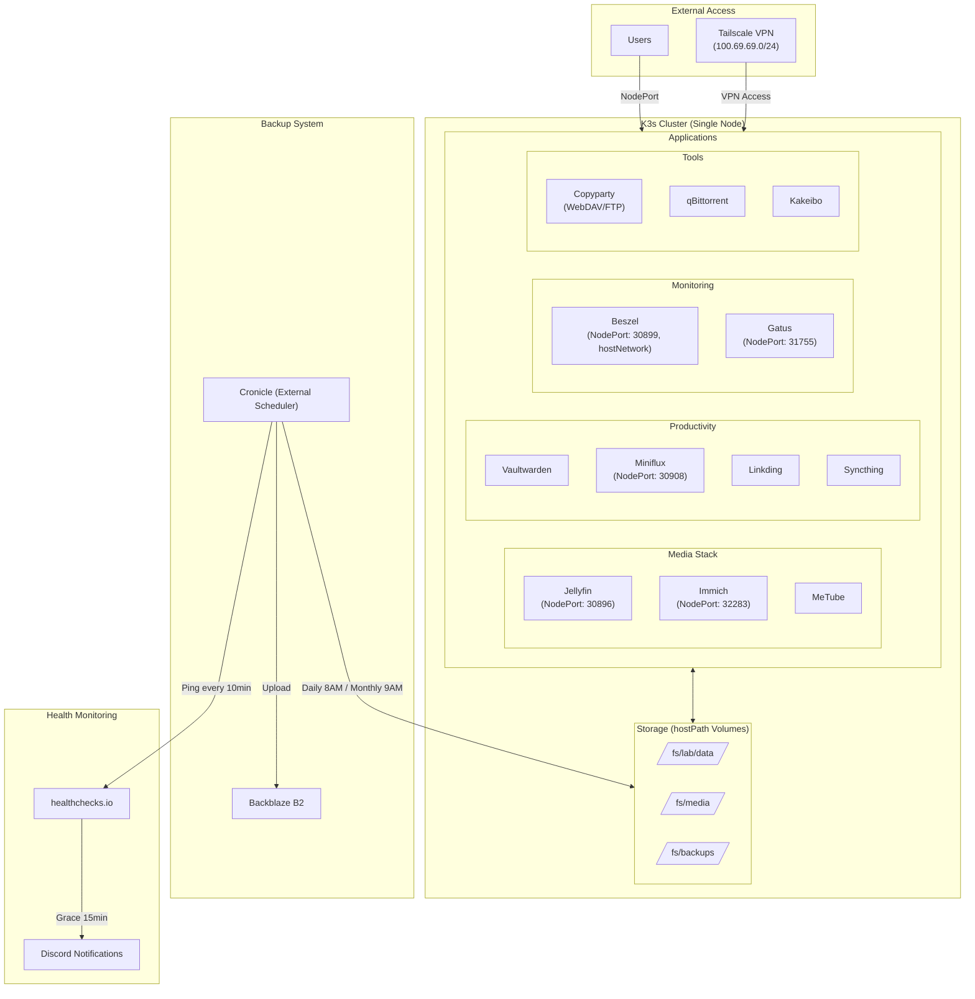

# K3s Homelab Architecture

## Overview

This repository contains Kubernetes manifests for a single-node k3s homelab deployment. The cluster runs various self-hosted applications with NodePort services for external access and hostPath volumes for persistent storage.

## Architecture



## Health Monitoring

Health monitoring is handled externally by **Cronicle** which pings **healthchecks.io**:

- **Ping Interval**: Every 10 minutes
- **Grace Period**: 15 minutes (if no ping received)
- **Notifications**: Sent to Discord and Email after grace period expires

## Backup Strategy

Backups are scheduled via **Cronicle** and stored in **Backblaze B2**:

- **Daily backups** at 8:00 AM, retaining last 30 days
- **Monthly backups** at 9:00 AM, retaining last 12 months

**Backup Flow:**
1. Cronicle triggers backup jobs on the schedule
2. Snapshots are uploaded to Backblaze B2
3. Retention policy automatically prunes old backups

## Storage Architecture

All applications use **hostPath** volumes mounted from the host filesystem:

```
/fs/
├── lab/
│   └── data/          # Application data
│       ├── beszel/
│       ├── immich/
│       ├── jellyfin/
│       ├── vaultwarden/
│       ├── k9s-ui/
│       ├── syncthing/
│       ├── miniflux/
│       ├── linkding/
│       ├── kakeibo/
│       └── copyparty/
├── media/             # Media files (movies, tv)
└── backups/
    ├── warm/          # Active backup storage
    │   └── metube/
    └── cold/          # Archival storage
        └── movies/
```

## Deployment

### Prerequisites

1. A Linux server with k3s installed
2. `kubectl` configured to communicate with the cluster
3. Host directories created at `/fs/lab/data/`, `/fs/media/`, `/fs/backups/`
4. Secrets configured for applications requiring authentication (see each application's `secret.example.yml`)

### Initial Setup

```bash
# Clone the repository
git clone <repository-url>
cd k3s-homelab

# Create required directories on the host
sudo mkdir -p /fs/lab/data/{beszel,immich,jellyfin,vaultwarden,syncthing,miniflux,linkding,kakeibo,copyparty,metube}
sudo mkdir -p /fs/media
sudo mkdir -p /fs/backups/{warm,cold}

# Set appropriate permissions
sudo chown -R $USER:$USER /fs/lab/data
sudo chown -R $USER:$USER /fs/media
sudo chown -R $USER:$USER /fs/backups
```

### Applying Manifests

```bash
# Apply all deployments and services recursively
kubectl apply -f k3s/ --recursive

# Or apply specific application only
kubectl apply -f k3s/immich/

# Or simply use scripts/k3s-deploy.sh
cp k3s-deploy /usr/local/bin;
k3s-deploy -d <dir> -n <namespace> deploy|delete
```

### Updating Deployments

```bash
# Apply changes after modifying manifests
kubectl apply -f k3s/ --recursive

# Restart a specific deployment
kubectl rollout restart deployment/<deployment-name>

# View rollout status
kubectl rollout status deployment/<deployment-name>
```
